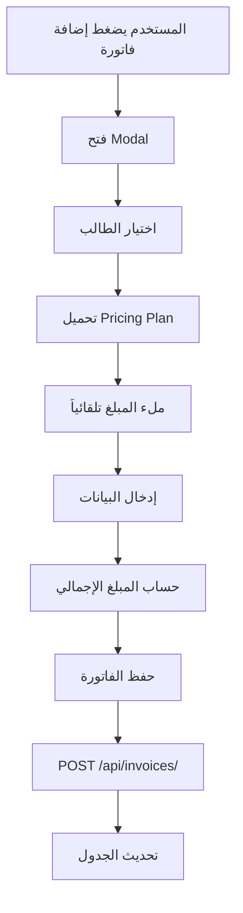

# دليل المطور - صفحة الفواتير

## 📁 هيكل الملفات

```
frontend/
├── pages/
│   └── invoices.html          # الصفحة الرئيسية + 3 Modals
├── js/
│   └── invoices.js            # المنطق والـ API calls
└── css/
    └── style.css              # التصميم (تم إضافة styles للـ modals)

core/
├── models.py                  # Model: Invoice
├── serializers.py             # InvoiceSerializer, InvoiceCreateSerializer
├── views.py                   # InvoiceViewSet
└── urls.py                    # API URLs
```

---

## 🔌 API Endpoints

### الفواتير (Invoices)

#### قائمة الفواتير
```http
GET /api/invoices/
```

**Response:**
```json
[
  {
    "id": "uuid",
    "invoice_number": "INV-202501-000001",
    "student": "uuid",
    "student_name": "اسم الطالب",
    "month": 1,
    "year": 2025,
    "base_amount": "100.00",
    "discount_amount": "10.00",
    "discount_percentage": "10.00",
    "additional_charges": "5.00",
    "total_amount": "95.00",
    "amount_paid": "50.00",
    "amount_due": "45.00",
    "currency_code": "USD",
    "currency_symbol": "$",
    "expected_sessions": 8,
    "completed_sessions": 0,
    "status": "partial",
    "issue_date": "2025-01-01",
    "due_date": "2025-01-10",
    "is_overdue": false
  }
]
```

#### إنشاء فاتورة
```http
POST /api/invoices/
Content-Type: application/json

{
  "invoice_number": "INV-202501-000001",
  "student": "uuid",
  "month": 1,
  "year": 2025,
  "billing_period_start": "2025-01-01",
  "billing_period_end": "2025-01-31",
  "base_amount": "100.00",
  "discount_amount": "10.00",
  "discount_percentage": "10.00",
  "additional_charges": "5.00",
  "subtotal": "90.00",
  "total_amount": "95.00",
  "amount_paid": 0,
  "amount_due": "95.00",
  "currency_code": "USD",
  "currency_symbol": "$",
  "expected_sessions": 8,
  "status": "pending",
  "issue_date": "2025-01-01",
  "due_date": "2025-01-10"
}
```

#### تعديل فاتورة
```http
PATCH /api/invoices/{id}/
Content-Type: application/json

{
  "discount_percentage": "15.00",
  "additional_charges": "10.00",
  "notes": "ملاحظات جديدة"
}
```

#### حذف فاتورة
```http
DELETE /api/invoices/{id}/
```

#### إنشاء فواتير شهرية
```http
POST /api/invoices/generate_monthly_invoices/
Content-Type: application/json

{
  "month": 1,
  "year": 2025
}
```

**Response:**
```json
{
  "message": "تم إنشاء 10 فاتورة بنجاح",
  "created_count": 10
}
```

---

## 💾 نموذج البيانات (Invoice Model)

```python
class Invoice(models.Model):
    id = UUIDField(primary_key=True)
    invoice_number = CharField(max_length=50, unique=True)
    student = ForeignKey(Student)
    month = IntegerField()
    year = IntegerField()
    billing_period_start = DateField()
    billing_period_end = DateField()
    base_amount = DecimalField(max_digits=10, decimal_places=2)
    discount_amount = DecimalField(null=True)
    discount_percentage = DecimalField(null=True)
    discount_reason = TextField(null=True)
    additional_charges = DecimalField(null=True)
    subtotal = DecimalField()
    total_amount = DecimalField()
    amount_paid = DecimalField(default=0)
    amount_due = DecimalField()
    currency_code = CharField(max_length=3)
    currency_symbol = CharField(max_length=10)
    expected_sessions = IntegerField()
    completed_sessions = IntegerField(default=0)
    status = CharField(default='pending')
    issue_date = DateField()
    due_date = DateField()
    notes = TextField(null=True)
    created_at = DateTimeField(auto_now_add=True)
    updated_at = DateTimeField(auto_now=True)
```

---

## 🎨 Frontend Components

### 1. Add Invoice Modal

**HTML ID:** `addInvoiceModal`

**دوال:**
- `showAddInvoiceModal()` - فتح الـ modal
- `closeAddInvoiceModal()` - إغلاق الـ modal
- `onStudentChange()` - تحميل بيانات الطالب
- `calculateTotal()` - حساب المبلغ الإجمالي
- `saveInvoice(event)` - حفظ الفاتورة

**الحقول:**
```javascript
{
  studentSelect: 'اختيار الطالب',
  monthSelect: 'الشهر (1-12)',
  yearInput: 'السنة',
  baseAmountInput: 'المبلغ الأساسي',
  expectedSessionsInput: 'عدد الحصص',
  discountPercentageInput: 'نسبة الخصم',
  discountAmountInput: 'مبلغ الخصم (محسوب)',
  additionalChargesInput: 'رسوم إضافية',
  totalAmountInput: 'المبلغ الإجمالي (محسوب)',
  dueDateInput: 'تاريخ الاستحقاق',
  discountReasonInput: 'سبب الخصم',
  notesInput: 'ملاحظات'
}
```

### 2. Edit Invoice Modal

**HTML ID:** `editInvoiceModal`

**دوال:**
- `editInvoice(invoiceId)` - فتح الـ modal
- `closeEditInvoiceModal()` - إغلاق الـ modal
- `calculateEditTotal()` - حساب المبلغ الجديد
- `updateInvoice(event)` - حفظ التعديلات

### 3. Pay Invoice Modal

**HTML ID:** `payInvoiceModal`

**دوال:**
- `payInvoice(invoiceId)` - فتح الـ modal
- `closePayInvoiceModal()` - إغلاق الـ modal
- `submitPayment(event)` - تسجيل الدفعة

**الحقول:**
```javascript
{
  paymentAmountInput: 'المبلغ المدفوع',
  paymentMethodSelect: 'طريقة الدفع',
  paymentDateInput: 'تاريخ الدفع',
  transactionReferenceInput: 'رقم المعاملة',
  paymentNotesInput: 'ملاحظات'
}
```

---

## 🧮 الحسابات

### حساب المبلغ الإجمالي

```javascript
function calculateTotal() {
    const baseAmount = parseFloat(baseAmountInput.value) || 0;
    const discountPercentage = parseFloat(discountPercentageInput.value) || 0;
    const additionalCharges = parseFloat(additionalChargesInput.value) || 0;
    
    // حساب مبلغ الخصم
    const discountAmount = (baseAmount * discountPercentage) / 100;
    
    // حساب المبلغ بعد الخصم
    const subtotal = baseAmount - discountAmount;
    
    // حساب المبلغ الإجمالي
    const total = subtotal + additionalCharges;
    
    return {
        discountAmount,
        subtotal,
        total
    };
}
```

### تحديث حالة الفاتورة

```javascript
function updateInvoiceStatus(invoice, newPayment) {
    const newAmountPaid = invoice.amount_paid + newPayment;
    const newAmountDue = invoice.total_amount - newAmountPaid;
    
    let status = 'pending';
    if (newAmountDue <= 0) {
        status = 'paid';
    } else if (newAmountPaid > 0) {
        status = 'partial';
    }
    
    return {
        amount_paid: newAmountPaid,
        amount_due: newAmountDue,
        status: status
    };
}
```

---

## 🔄 سير العمل (Workflow)

### إضافة فاتورة



### تسجيل دفعة

```mermaid
graph TD
    A[المستخدم يضغط دفع] --> B[فتح Modal الدفع]
    B --> C[عرض معلومات الفاتورة]
    C --> D[إدخال بيانات الدفع]
    D --> E[حفظ الدفعة]
    E --> F[POST /api/payments/]
    F --> G[تحديث الفاتورة]
    G --> H[PATCH /api/invoices/{id}/]
    H --> I[تحديث الجدول]
```

---

## 🎯 أمثلة الاستخدام

### مثال 1: إنشاء فاتورة برمجياً

```javascript
async function createInvoice(studentId, month, year) {
    const student = await api.get(`/api/students/${studentId}/`);
    const pricingPlan = await api.get(`/api/pricing-plans/${student.pricing_plan}/`);
    
    const invoiceData = {
        invoice_number: generateInvoiceNumber(month, year),
        student: studentId,
        month: month,
        year: year,
        billing_period_start: `${year}-${month.toString().padStart(2, '0')}-01`,
        billing_period_end: getLastDayOfMonth(year, month),
        base_amount: pricingPlan.monthly_price,
        discount_percentage: student.discount_percentage || 0,
        discount_amount: calculateDiscount(pricingPlan.monthly_price, student.discount_percentage),
        subtotal: calculateSubtotal(pricingPlan.monthly_price, student.discount_percentage),
        total_amount: calculateTotal(pricingPlan.monthly_price, student.discount_percentage),
        amount_paid: 0,
        amount_due: calculateTotal(pricingPlan.monthly_price, student.discount_percentage),
        currency_code: student.country.currency_code,
        currency_symbol: student.country.currency_symbol,
        expected_sessions: pricingPlan.sessions_per_week * 4,
        status: 'pending',
        issue_date: new Date().toISOString().split('T')[0],
        due_date: getDueDate(10) // 10 days from now
    };
    
    return await api.post('/api/invoices/', invoiceData);
}
```

### مثال 2: تسجيل دفعة

```javascript
async function recordPayment(invoiceId, amount, method) {
    const invoice = await api.get(`/api/invoices/${invoiceId}/`);
    
    // إنشاء الدفعة
    const paymentData = {
        payment_number: generatePaymentNumber(),
        invoice: invoiceId,
        student: invoice.student,
        amount: amount,
        currency_code: invoice.currency_code,
        currency_symbol: invoice.currency_symbol,
        payment_method: method,
        payment_date: new Date().toISOString().split('T')[0],
        status: 'completed'
    };
    
    await api.post('/api/payments/', paymentData);
    
    // تحديث الفاتورة
    const newAmountPaid = parseFloat(invoice.amount_paid) + amount;
    const newAmountDue = invoice.total_amount - newAmountPaid;
    
    const updateData = {
        amount_paid: newAmountPaid,
        amount_due: newAmountDue,
        status: newAmountDue <= 0 ? 'paid' : 'partial',
        last_payment_date: new Date().toISOString().split('T')[0]
    };
    
    if (newAmountDue <= 0) {
        updateData.paid_date = new Date().toISOString().split('T')[0];
    }
    
    return await api.patch(`/api/invoices/${invoiceId}/`, updateData);
}
```

---

## 🐛 استكشاف الأخطاء

### المشكلة: المبلغ لا يُحسب تلقائياً

**الحل:**
```javascript
// تأكد من استدعاء calculateTotal() عند تغيير أي قيمة
document.getElementById('baseAmountInput').addEventListener('change', calculateTotal);
document.getElementById('discountPercentageInput').addEventListener('change', calculateTotal);
document.getElementById('additionalChargesInput').addEventListener('change', calculateTotal);
```

### المشكلة: الطالب ليس له pricing plan

**الحل:**
```javascript
if (student.pricing_plan) {
    // استخدم pricing plan
    const plan = await api.get(`/api/pricing-plans/${student.pricing_plan}/`);
    baseAmount = plan.monthly_price;
} else if (student.custom_monthly_price) {
    // استخدم السعر المخصص
    baseAmount = student.custom_monthly_price;
} else {
    // اطلب من المستخدم إدخال المبلغ يدوياً
    Swal.fire({
        icon: 'warning',
        title: 'تنبيه',
        text: 'الطالب ليس له نظام تسعير، يرجى إدخال المبلغ يدوياً'
    });
}
```

### المشكلة: الفاتورة مكررة

**الحل:**
```javascript
// تحقق من وجود فاتورة قبل الإنشاء
const existingInvoice = invoices.find(i => 
    i.student === studentId && 
    i.month === month && 
    i.year === year
);

if (existingInvoice) {
    Swal.fire({
        icon: 'error',
        title: 'خطأ',
        text: 'يوجد فاتورة لهذا الطالب في نفس الشهر'
    });
    return;
}
```

---

## 📝 ملاحظات للمطورين

1. **رقم الفاتورة** يجب أن يكون فريداً
2. **المبالغ** يجب أن تكون Decimal وليس Float
3. **التواريخ** بصيغة ISO: `YYYY-MM-DD`
4. **العملة** يجب أن تتطابق مع عملة الطالب
5. **الحالة** تُحدث تلقائياً، لا تُعدل يدوياً
6. **المدفوعات** يجب أن تُسجل في جدول منفصل (payments)
7. **التحقق** يتم على مستوى Frontend و Backend

---

## 🚀 التطوير المستقبلي

### ميزات مقترحة:
- [ ] طباعة الفاتورة PDF
- [ ] إرسال الفاتورة بالبريد الإلكتروني
- [ ] تذكير تلقائي بالفواتير المتأخرة
- [ ] تقارير مالية متقدمة
- [ ] دعم عملات متعددة
- [ ] خصومات تلقائية بناءً على قواعد
- [ ] دفع إلكتروني مباشر
- [ ] سجل تاريخ التعديلات

---

تاريخ التحديث: 11 يناير 2026
